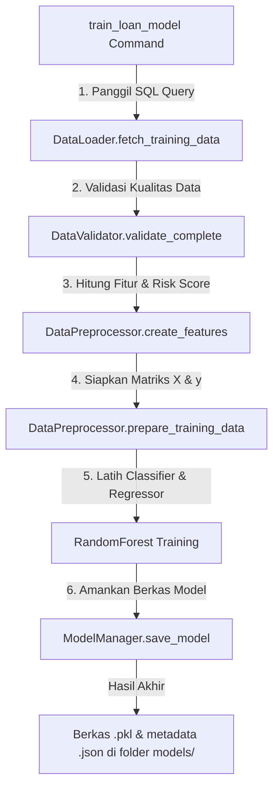
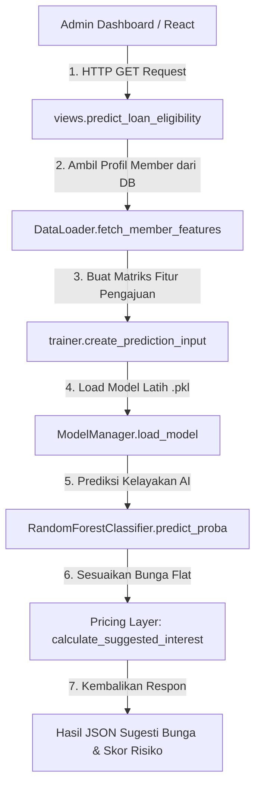

# Koperasi Sanoh - Machine Learning (ML) Service Manual

ML Service adalah sub-modul cerdas di Koperasi Sanoh yang bertanggung jawab untuk menilai kelayakan kredit anggota (*Credit Scoring*) dan merekomendasikan suku bunga flat yang adil berdasarkan profil risiko masing-masing anggota (*Risk-Based Pricing*).

Sub-modul ini telah disederhanakan secara komprehensif agar memiliki arsitektur yang bersih, performa tinggi, bebas dari data leakage, dan mudah dirawat.

---

## 📁 Struktur Proyek (Simplified Architecture)

Folder `ml_service` kini berjalan dengan struktur kompak **5 File Utama** setelah disederhanakan dari arsitektur modular yang rumit:

```text
ml_service/
  ├── management/commands/
  │    ├── train_loan_model.py     # Command Django untuk melatih model AI
  │    └── schedule_training.py    # Command penjadwal pelatihan berkala
  ├── models/                      # Folder tempat berkas biner model terlatih (.pkl & .json)
  ├── config.py                    # Pusat kendali: Kueri SQL & Setelan Hyperparameter AI
  ├── utils.py                     # Satu berkas utilitas terpadu (Loader, Validator, Preprocessor, Manager)
  ├── trainer.py                   # Mesin prediksi utama & Rule-Based Pricing Layer
  ├── urls.py                      # Django routing untuk endpoint ML
  └── views.py                     # Django API Controllers (Request/Response)
```

---

## 📊 10 Fitur Utama (AI Features)

Model Machine Learning dilatih dan memprediksi menggunakan kueri SQL perilaku finansial terperinci dari anggota:

| Nama Fitur | Kategori | Penjelasan |
| :--- | :--- | :--- |
| `age` | Profil Member | Umur anggota saat ini (mengukur kedewasaan finansial). |
| `member_tenure_months` | Profil Member | Durasi keanggotaan dalam bulan sejak bergabung dengan koperasi. |
| `employee_status_id` | Profil Member | ID status kepegawaian (mengukur stabilitas pendapatan bulanan). |
| `amount_requested` | Detail Pinjaman | Jumlah nominal pengajuan pinjaman yang diminta. |
| `duration_months` | Detail Pinjaman | Tenor/durasi pinjaman (jangka waktu cicilan dalam bulan). |
| `monthly_installment_estimation` | Detail Pinjaman | Estimasi beban cicilan bulanan yang harus dibayar anggota. |
| `total_savings_amount` | Perilaku Simpanan | Akumulasi total simpanan yang dimiliki anggota saat ini. |
| `savings_loan_ratio` | Perilaku Simpanan | Jaminan finansial (Total Tabungan / Nominal Pinjaman yang diajukan). |
| `saving_payment_ratio` | Perilaku Simpanan | Konsistensi/Disiplin iuran wajib bulanan anggota (skala 0.0 - 1.0). |
| `overall_risk_score` | Penilaian Risiko | Skor risiko akhir (0-100) gabungan dari rasio tabungan dan disiplin menabung. |

---

## 🔄 Alur Kerja Sistem (System Flows)

### Flow A: Alur Pelatihan Model (Retraining Pipeline)
*Tujuan: Memperbarui tingkat akurasi model AI dengan mempelajari data transaksi baru secara berkala.*



1. Perintah `python manage.py train_loan_model` dijalankan.
2. `DataLoader` memanggil `TRAINING_DATA_QUERY` untuk mengambil riwayat pinjaman riil dari PostgreSQL.
3. `DataValidator` menyaring data berdasarkan batas kualitas (`DATA_QUALITY_CONFIG`).
4. `DataPreprocessor` merekayasa nilai `overall_risk_score` untuk setiap baris.
5. Model *Random Forest Classifier* dilatih untuk mendeteksi gagal bayar (berdasarkan keterlambatan >30 hari).
6. `ModelManager` mengompres model menjadi berkas `.pkl` berversi timestamp dan menyimpannya di folder `models/`.

---

### Flow B: Alur Prediksi Real-Time & Pricing Layer
*Tujuan: Menghitung kelayakan dan merekomendasikan suku bunga flat yang adil saat pengajuan pinjaman.*



1. Admin membuka halaman detail pengajuan pinjaman di dashboard.
2. Endpoint Django `/api/ml/predict-eligibility/` dipicu.
3. Sistem mengambil status iuran wajib dan saldo tabungan member saat ini via `PREDICTION_QUERY`.
4. `create_prediction_input()` menghitung rasio jaminan dan beban cicilan bulanan pengajuan baru tersebut.
5. AI Classifier memprediksi probabilitas kelayakan kredit (*High / Medium / Low Risk*).
6. **Pricing Layer (Behavior-Based Pricing)** menentukan suku bunga flat akhir dengan formula:
   $$\text{Saran Suku Bunga} = \text{Bunga Dasar (Base Rate)} + \text{Penyesuaian Risiko (Behavioral Adjustment)}$$
   *   Anggota Disiplin (`overall_risk_score` rendah): Mendapat bunga dasar murni (**Adjustment +0%**).
   *   Anggota Kurang Disiplin (`overall_risk_score` tinggi): Mendapat denda risiko (**Adjustment +1.5%**).

---

## 🛠️ Cara Menjalankan & Menguji ML Service

### 1. Melatih Model AI Secara Manual
Jalankan perintah berikut di terminal backend untuk melatih ulang AI menggunakan data terbaru di database:
```bash
python manage.py train_loan_model
```

Untuk menguji alur latihan tanpa menyimpan berkas model baru (Uji Coba/Dry-Run):
```bash
python manage.py train_loan_model --dry-run
```

### 2. Pemicu Penjadwalan Pelatihan Otomatis
Sistem ini dilengkapi dengan pengecek otomatis yang melatih ulang model jika ditemukan data baru $\ge 15$ rekaman atau masa latihan terakhir sudah $\ge 7$ hari:
```bash
python manage.py schedule_training
```

---

## ⚙️ Penjelasan Kegunaan Masing-Masing File

### 1. `config.py`
Pusat pengaturan seluruh sistem ML. Mengatur setelan hyperparameter AI (`n_estimators`, `max_depth`), batas atas-bawah suku bunga dasar (`INTEREST_RATE_RANGES`), dan aturan kualitas data latihan di development environment agar aman dari pemblokiran latihan saat data masih sedikit (`DATA_QUALITY_CONFIG`).

### 2. `utils.py`
Satu berkas terpadu yang memadukan fungsi data:
*   `DataLoader`: Menjembatani SQL PostgreSQL ke data frame Pandas.
*   `DataValidator`: Mencegah *data leakage* di masa depan dan memantau ketimpangan kelas target.
*   `DataPreprocessor`: Melakukan imputasi nilai kosong menggunakan median dan merumuskan skor risiko anggota.
*   `ModelManager`: Bertanggung jawab atas siklus hidup berkas model (menyimpan, memuat, dan menghapus model lama).

### 3. `trainer.py`
Jantung pengambil keputusan AI. Berisi logika `get_prediction()` untuk menyatukan prediksi kelayakan kredit, analisis detail faktor risiko anggota (*Risk Factors*), dan mesin kalkulator penentu bunga (*Pricing Layer*).

### 4. `views.py` & `urls.py`
Gerbang API HTTP. Memungkinkan admin dashboard frontend React berkomunikasi dengan program Python ML di backend. Menangani endpoint penarikan skor risiko dan riwayat latihan model.
